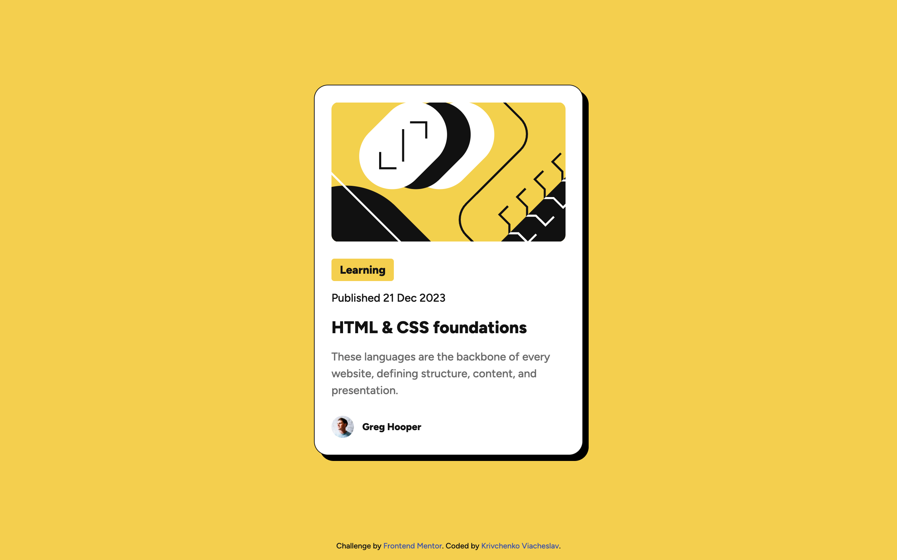
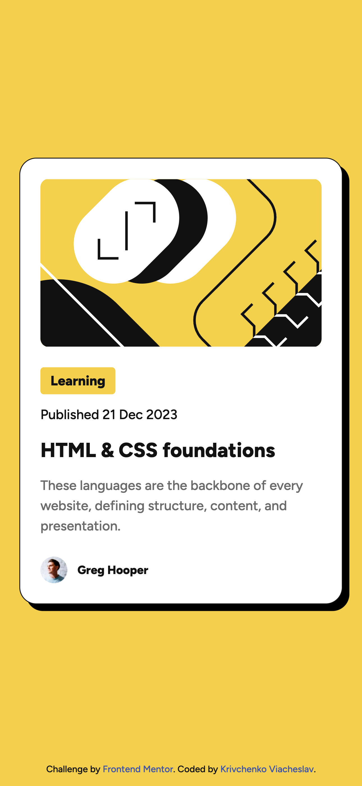

# Frontend Mentor - Blog preview card solution

This is a solution to the [Blog preview card challenge on Frontend Mentor](https://www.frontendmentor.io/challenges/blog-preview-card-ckPaj01IcS). Frontend Mentor challenges help you improve your coding skills by building realistic projects.

## Table of contents

- [Overview](#overview)
  - [The challenge](#the-challenge)
  - [Screenshots](#screenshots)
  - [Links](#links)
- [My process](#my-process)
  - [Built with](#built-with)
- [Author](#author)

## Overview

### The challenge

Users should be able to:

- See hover and focus states for all interactive elements on the page

### Screenshots

### Links

- Solution URL: [Frontend Mentor's solution page](https://www.frontendmentor.io/solutions/responsive-blog-preview-card-with-semantics-and-accessibility-V319D6UFVs)
- Live Site URL: [GitHub Pages](https://krivchenko74.github.io/frontend_mentor_solutions/blog_preview_card/)

## My process

### Built with

- Semantic HTML5 markup
- CSS custom properties
- Flexbox
- CSS Grid

## Author

- GitHub - [@krivchenko74](https://github.com/krivchenko74)
- Frontend Mentor - [@krivchenko74](https://www.frontendmentor.io/profile/krivchenko74)
