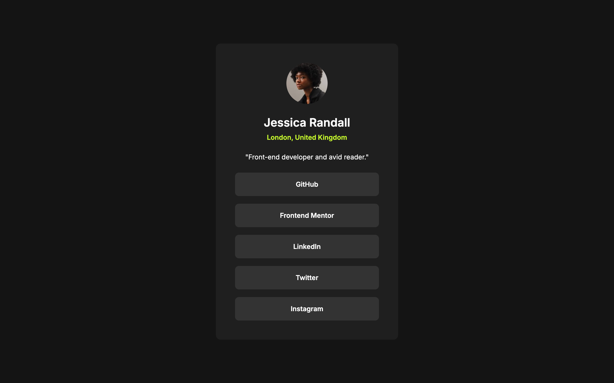
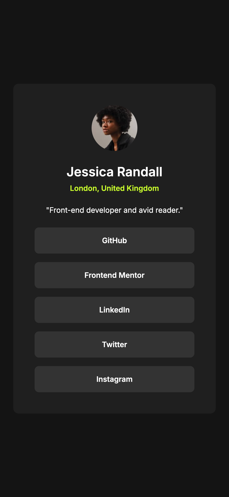

# Frontend Mentor - Social links profile solution

This is a solution to the [Social links profile challenge on Frontend Mentor](https://www.frontendmentor.io/challenges/social-links-profile-UG32l9m6dQ). Frontend Mentor challenges help you improve your coding skills by building realistic projects.

## Table of contents

- [Overview](#overview)
  - [The challenge](#the-challenge)
  - [Screenshot](#screenshot)
  - [Links](#links)
- [My process](#my-process)
  - [Built with](#built-with)
- [Author](#author)

## Overview

### The challenge

Users should be able to:

- See hover and focus states for all interactive elements on the page

### Screenshot

### Links

- Solution URL: [Frontend Mentor's solution page](https://www.frontendmentor.io/solutions/responsive-socials-links-component-sHdbnIlZh_)
- Live Site URL: [GitHub Pages](https://krivchenko74.github.io/frontend_mentor_solutions/social_links/)

## My process

### Built with

- Semantic HTML5 markup
- CSS custom properties
- Flexbox
- CSS Grid
- BEM

## Author

- GitHub - [@krivchenko74](https://github.com/krivchenko74)
- Frontend Mentor - [@krivchenko74](https://www.frontendmentor.io/profile/krivchenko74)
